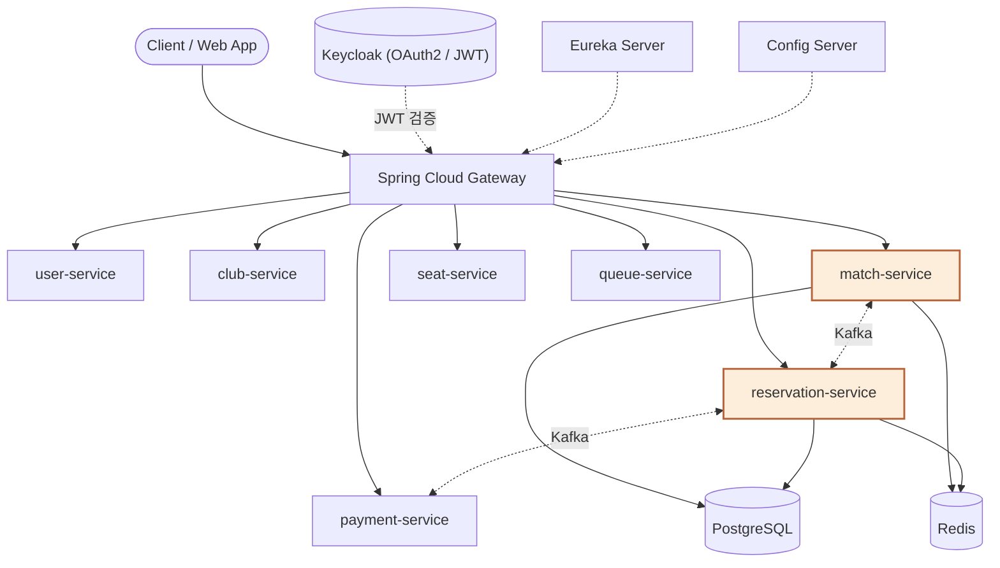
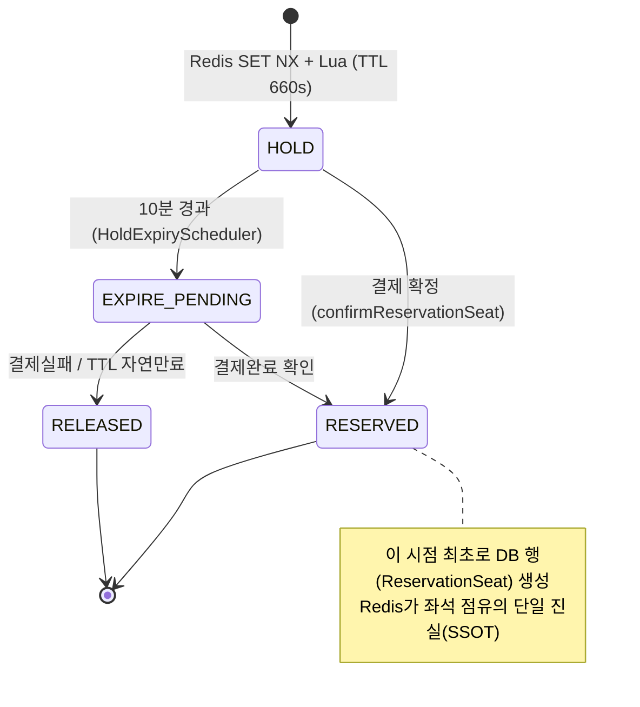

# 🎫 reservation-service (3sTICKETING)


> **3sTICKETING** 플랫폼에서 **예매(Reservation) 생성부터 좌석 선점, 결제 확정, 취소·만료, QR 티켓 발급**까지 예매 라이프사이클 전체를 담당하는 마이크로서비스입니다.

인기 경기 오픈 순간 동일 좌석에 몰리는 동시 요청을 Redis 원자 연산만으로 안전하게 처리하는 데 중점을 두고 설계되었습니다.

---

## 📖 Core Domain

* **Reservation (애그리게이트 루트):** 한 사용자가 한 경기에 대해 생성하는 예매입니다.
  * **상태 전이:** `PENDING` → `COMPLETED` / `EXPIRED` / `CANCELLED`
* **ReservationSeat:** Reservation의 자식 엔티티. HOLD 단계는 Redis가 단독으로 관리하므로, DB에는 결제 확정 시점에 항상 `RESERVED` 상태로 생성되며 이후 `CANCELED`로만 전이됩니다.
* **Ticket:** 예매 확정 시 자동 발급되는 QR 티켓. `AVAILABLE` → `USED` / `CANCELED` 상태를 가집니다.

**핵심 설계 원칙 — "Redis가 좌석 점유의 단일 진실(SSOT)"**: 좌석의 실제 선착순 점유는 DB가 아니라 Redis Lua 스크립트로 원자적으로 처리됩니다. DB 커밋과 Redis 정리의 순서를 항상 "DB 커밋 → Redis 정리"로 고정해, 트랜잭션 롤백 시 Redis가 먼저 풀려 다른 사용자가 좌석을 가로채는 상황을 방지합니다.

---

## 🏗️ Architecture

reservation-service는 Eureka·Config Server·Gateway 기반 3sTICKETING MSA의 일원으로, match-service로부터 좌석 등급 가격을 Feign으로 조회하고 Kafka를 통해 payment-service·match-service와 이벤트를 주고받습니다.



*주황색 = 담당 서비스(match-service, reservation-service)*

---

## ✨ Key Features & Technical Decisions

### 1. 좌석 선점(Hold) — Redis SET NX + Lua Script
인기 경기 오픈 시 동일 좌석에 대한 동시 hold 요청이 몰리는 문제를 해결하기 위해, DB 비관적/낙관적 락이나 Redisson 분산 락 대신 **Redis SET NX + Lua Script**를 채택했습니다. 하나의 Lua 스크립트 안에서 예매당 최대 좌석 수(4석) 검증, 좌석 점유, 만료 인덱스 등록을 모두 원자적으로 처리해 race condition과 초과 예매를 원천 차단합니다.



### 2. 좌석 확정(Confirm) — 결제 확정 시 DB 기록
좌석 hold 후 결제가 확정되면 match-service 내부 API로 가격을 조회해 스냅샷으로 저장하고, Redis 좌석 상태를 `HOLD → RESERVED`로 원자 전이합니다. DB 저장과 Redis 전이 중 하나라도 실패하면 사용자에게 재시도를 안내합니다.

### 3. HOLD 만료 스케줄러
30초 주기 스케줄러가 결제 윈도우(10분)를 초과한 HOLD를 감지해 `HOLD → EXPIRE_PENDING`으로 원자 전이한 뒤, 결제 상태에 따라 예매를 확정(`confirm`)하거나 만료(`expire`) 처리합니다. Kafka는 at-least-once 전달을 보장하므로 예매 확정/만료 모두 멱등 처리됩니다.

### 4. Kafka 이벤트 기반 정합성 보정
* `payment.completed` 소비 → 예매 확정. 재시도(4회, 지수 백오프) 후에도 실패하면 DLT로 격리하고 `reservation.confirmation.failed` 이벤트를 발행해 payment-service가 환불을 수행하도록 합니다.
* `payment.failed` / `payment.refunded` 소비 → 예매 취소 및 좌석 해제.
* `match.canceled` 소비 → 해당 경기의 취소 가능한 예매(PENDING/COMPLETED)를 일괄 취소.
* 예매 확정 시 좌석 예약/해제 이벤트(`reservation.seat.reserved` / `reservation.seat.released`)를 발행해 match-service가 잔여 좌석 카운터를 갱신하도록 합니다.
* 모든 발행은 Outbox 패턴, 모든 소비는 Inbox 패턴(`@IdempotentConsumer`)으로 처리해 발행 유실과 중복 소비를 방지합니다.

### 5. QR 티켓 발급
예매가 확정(`COMPLETED`)되면 트랜잭션 커밋 후 리스너가 자동으로 QR 티켓을 발급합니다. 환불 등으로 예매가 취소되면 티켓도 함께 취소·소프트 삭제됩니다.

---

## 🌐 API Reference

| Method | Endpoint | Description |
| :--- | :--- | :--- |
| `POST` | `/api/reservations` | 빈 PENDING 예매 생성 |
| `GET` | `/api/reservations` | 내 예매 목록 조회 |
| `GET` | `/api/reservations/{reservationId}` | 예매 상세 조회 (좌석 포함) |
| `DELETE` | `/api/reservations/{reservationId}` | 예매 전체 취소 |
| `POST` | `/api/reservation-seats/hold` | 좌석 선점 (Redis HOLD) |
| `DELETE` | `/api/reservation-seats/{reservationSeatId}` | 좌석 개별 취소 |
| `GET` | `/api/reservation-seats/{reservationSeatId}` | 예약 좌석 상세 조회 |
| `GET` | `/api/reservation-seats?reservationId=` | 예매의 전체 좌석 조회 |

---

## 🚀 Getting Started

Mac 터미널 환경을 기준으로 로컬에서 프로젝트를 빌드하고 실행하는 방법입니다.

### Prerequisites
* Java 17
* Docker (PostgreSQL, Redis, Kafka 컨테이너용)

### Run
```bash
# 1. 인프라 컨테이너 실행 (docker-compose 파일이 있는 경우)
docker-compose up -d

# 2. 프로젝트 빌드 및 실행
./gradlew clean build -x test
./gradlew bootRun
```

---

## 🛠 Troubleshooting

* [티켓팅 좌석 선점, 왜 Redis SET NX + Lua Script 였나](https://tpdudznzl.tistory.com/38)
